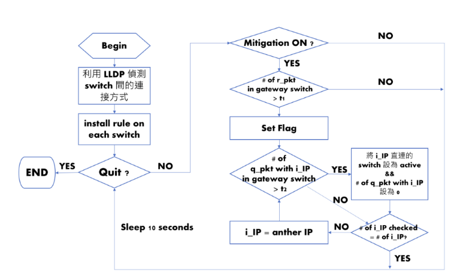
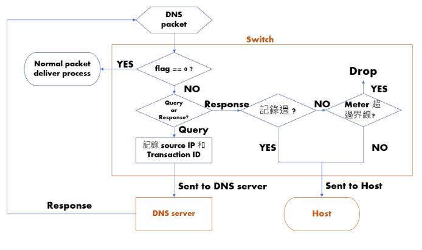

# DNS Attack Prevention via P4 switch with SDN 

## Dependency
export PYTHON="python3"
* remember to install thrift & nnpy by python3
    * change bmv2/travis/install-thrift.sh
    * python -> python3
    * bash ./install-thrift.sh -f
* install protobuf/python/setup.py with python3
```
sudo apt-get install python3-pil python3-pil.imagetk
sudo pip install -r requirements.txt
```

## Usage
```
cd source
make run
```

## Flow of Controller


## Flow of Switch (P4)

